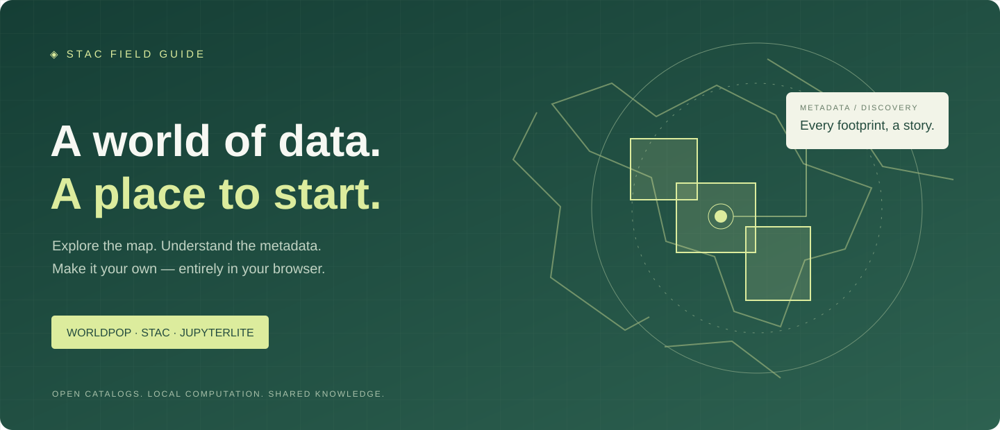

# JupyterLite STAC Browser



A map-centric, browser-only field guide for **WorldPop** and other public STAC catalogs. Explore metadata footprints, inspect dataset assets and attribution, then reproduce your search in executable Python notebooks. No account, API key or Python application server is required.

**[Explorer](https://jltobias.github.io/JupyterLite-STAC-Browser/explorer/)** · **[JupyterLite notebooks](https://jltobias.github.io/JupyterLite-STAC-Browser/lite/lab/index.html?path=01_launch_map.ipynb)** · **[Jupyter Book](https://jltobias.github.io/JupyterLite-STAC-Browser/book/)** · **[Notebook source](notebooks/)**

The [Pages workflow](https://github.com/jltobias/JupyterLite-STAC-Browser/actions/workflows/pages.yml) builds and publishes these three entry points together.

## Start exploring

1. Open the Explorer. It connects to [WorldPop's STAC API](https://api.stac.worldpop.org).
2. Choose a country collection such as `UGA` or `KEN`. The map zooms to its coverage and the search bounding box is filled automatically. To refine the area, move the map and select **Use map extent**.
3. **From** defaults to the collection's earliest advertised date (January 1, 2000 if unavailable) and **Until** to today's date in your browser. Switching collections resets these defaults; you can edit or clear either date. Search, select a footprint, and inspect the original metadata, providers, license and asset links.
4. Export loaded Items as GeoJSON and save the query as Search JSON. Export copies resolve relative asset/source links to absolute URLs; the client keeps the original metadata intact. The provenance `retrieved_at` value records the last successful item/page retrieval and stays unchanged when exporting again.
5. Open JupyterLite and run the three tutorials: launch the map, search WorldPop, explore other catalogs and reuse exports.

The map shows **metadata coverage, not population raster values**. Raster assets are never downloaded automatically. WorldPop `datetime` can describe a release date; inspect `properties.year` and `properties.project` for the population reference year/product.

**Copernicus Data Space** is the second catalog option after WorldPop. Select it and click **Connect to catalog** to discover Sentinel and other Earth observation collections through `https://stac.dataspace.copernicus.eu/v1`. The collection list is alphabetical; selecting a collection sets the map extent, bounding box, and date defaults. Narrow the area and dates before searching a global collection. Copernicus collection discovery requests up to 1,000 entries; use **Load more collections** if the provider advertises another page within that cap.

Earth Search and Planetary Computer presets are also included. Custom HTTPS STAC Catalog or Collection URLs are supported. APIs use their advertised search/collection links; static catalogs remain navigable through child/item links without claiming remote search.

## Reproducible local build

Prerequisites: **Python 3.11–3.13**, **Node.js 22+**, and network access for packages, MyST themes and initial runtime downloads.

```bash
python -m venv .venv
# Linux/macOS: source .venv/bin/activate
# Windows PowerShell: .venv\Scripts\Activate.ps1
python -m pip install -r requirements.txt
python -m unittest discover -s tests -p 'test_*.py' -v
node --test tests/test_stac.mjs
python scripts/build.py
python -m http.server 8000 --directory _site
```

Open **http://localhost:8000/**. The server only serves files. Output contains `index.html`, `explorer/`, `lite/`, and `book/`.

For repository-subpath hosting:

```bash
python scripts/build.py --base-url /JupyterLite-STAC-Browser
python -m playwright install chromium
python tests/browser_check.py --base-path /JupyterLite-STAC-Browser
```

The browser verification script serves the built output at the requested path. For manual preview of a root build, use the HTTP command above. Rebuild without `--base-url` when moving the MyST book back to root hosting.

Pinned primary dependencies are in `requirements.txt`. Jupyter Book 2 generates a MyST static website; JupyterLite includes the Pyodide kernel and all three notebooks plus `stac_browser.py`. Leaflet 1.9.4 is vendored locally with its license. Regenerate tutorial sources, if edited in the generator, with `python scripts/create_notebooks.py`.

## Tests and deployment

`python -m unittest discover -s tests -p 'test_*.py' -v` validates Python protocol behavior, build staging and notebooks. `node --test tests/test_stac.mjs` checks the JavaScript client protocol. `python tests/browser_check.py` checks browser protocol and UI against deterministic fixtures, including malicious metadata, errors, exports and mobile layout. `python tests/lite_check.py --fixtures --base-path /JupyterLite-STAC-Browser` executes the introductory notebook in real JupyterLite and checks its embedded explorer against synthetic catalog responses. These checks run in CI; the runtime test requires access to the Pyodide CDN.

For all three notebooks with live WorldPop and Earth Search requests, run `python tests/lite_check.py --base-path /JupyterLite-STAC-Browser`. Use `--base-path ""` for a root build. Add `--site-url https://jltobias.github.io/JupyterLite-STAC-Browser` to check the published site. Live tests use normal browser CORS/TLS enforcement; provider availability remains external.

Run `python tests/lite_check.py --copernicus --base-path /JupyterLite-STAC-Browser` to execute the third notebook with its documented Copernicus substitution, including a bounded Sentinel-2 search and exports. Add `--live` to `tests/browser_check.py` for live WorldPop and Copernicus discovery/search/pagination checks alongside its synthetic UI tests.

GitHub Actions builds and tests pull requests. On `main`, it uploads the combined static artifact and deploys with Pages Actions. Configure the repository's Pages source as **GitHub Actions**. No secrets are required. Publishing is separate from local generation.

## Limits and architecture

- Each network request has a 20-second timeout. Search pages contain 1–100 requested items; manually loaded results cap at 500, collections at 1,000, and displayed static links at 100.
- GET/POST pagination follows advertised next links and preserves POST body merging. Duplicate collection/item IDs are collapsed. Exports include only the pages you loaded.
- Dates and WGS84 bbox order are validated; antimeridian queries must be split.
- Catalogs must permit browser CORS and have valid HTTPS. There is no TLS or CORS bypass, proxy, authentication flow or fabricated fallback data.
- Metadata is rendered as text; links are restricted to HTTP(S). Supplied HTTPS alternatives are shown for S3 assets when available; original asset metadata is retained. Provider asset restrictions still apply, including Copernicus authentication and Planetary Computer signing where required.
- Initial Pyodide startup, APIs, OpenStreetMap tiles and optional fonts use the internet. Notebook changes live in browser storage; download files you need to retain.

See [architecture and troubleshooting](book/architecture.md) and [the exploration guide](book/exploration.md). The async Python helper uses `pyodide.http.pyfetch` in-browser and a standard-library adapter outside it. The notebook map is an iframe of the deployed explorer, preserving its hosting subpath.

## Sources, citation and credit

Default data: [WorldPop](https://www.worldpop.org/), its [Global2 announcement](https://www.worldpop.org/blog/worldpop-global2-global-high-resolution-population-estimates-for-2015-2030/) and [STAC API](https://api.stac.worldpop.org). Standards: [STAC](https://github.com/radiantearth/stac-spec) and [STAC API](https://github.com/radiantearth/stac-api-spec). Additional providers: [Copernicus Data Space Ecosystem](https://dataspace.copernicus.eu/) ([STAC browser](https://browser.stac.dataspace.copernicus.eu/), [STAC API documentation](https://documentation.dataspace.copernicus.eu/APIs/STAC.html)), [Earth Search / Element 84](https://element84.com/earth-search/) and [Microsoft Planetary Computer](https://planetarycomputer.microsoft.com/).

The following supplied references informed the workflow; no source code was copied:

1. [Development Seed stac-map](https://github.com/developmentseed/stac-map)
2. [PySTAC Client documentation](https://pystac-client.readthedocs.io/en/stable/)
3. [stacmap quickstart](https://stacmap.readthedocs.io/en/latest/tutorials/quickstart.html)
4. [Microsoft interactive-browser notebook on nbviewer](https://nbviewer.org/github/microsoft/PlanetaryComputerExamples/blob/main/tutorials/interactive-browser.ipynb) ([original source](https://github.com/microsoft/PlanetaryComputerExamples/blob/main/tutorials/interactive-browser.ipynb))

Basemap © [OpenStreetMap contributors](https://www.openstreetmap.org/copyright), ODbL; follow the [tile usage policy](https://operations.osmfoundation.org/policies/tiles/). Map rendering uses [Leaflet](https://leafletjs.com/) (BSD-2-Clause); notebook execution uses [JupyterLite](https://jupyterlite.readthedocs.io/) (BSD-3-Clause) and [Pyodide](https://pyodide.org/) (MPL-2.0); documentation uses [Jupyter Book 2](https://jupyterbook.org/) / [MyST](https://mystmd.org/) (MIT).

Code, notebooks, documentation and the **original splash SVG artwork** use the [MIT license](LICENSE). Dataset licenses remain with their providers. Consult [THIRD_PARTY_NOTICES.md](THIRD_PARTY_NOTICES.md) and the [full references](book/references.md). Cite the software with [CITATION.cff](CITATION.cff) and separately cite the datasets used.
